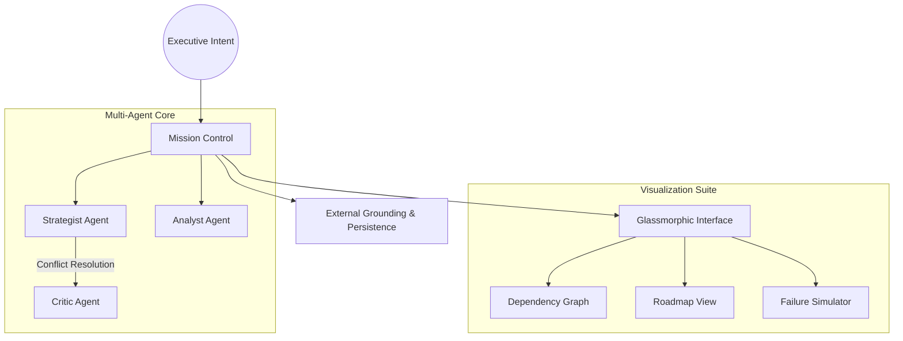

# 🌌 Atlas Strategic Agent V3.1.0

**Atlas V3.1.0** is an elite **Autonomous Strategic Agent** designed to bridge the gap between high-level executive intent and actionable enterprise roadmaps. Powered by a multi-agent collaborative core and a premium glassmorphic interface, it doesn't just decompose tasks—it orchestrates intelligence.

---

## 🚀 Key Innovation Pillars

### 🧠 Multi-Agent Collaborative Synthesis

Atlas operates through a triumvirate of specialized personas orchestrated by a decoupled **Agent Development Kit (ADK)**:

* **The Strategist**: Architect of goal decomposition and logic flows.
* **The Analyst**: Feasibility expert focused on data grounding and verification.
* **The Critic**: Risk assessor who identifies missing dependencies and failure points.

### 📉 Strategic Visualization Engine

* **Live Dependency Graph**: Interactive ReactFlow-based visualization with high-fidelity glassmorphic nodes.
* **GANTT Timeline**: A chronological roadmap view powered by **Framer Motion** for seamless temporal tracking.
* **What-If Simulation**: Predictive engine that models mission failure cascades and calculates real-time risk scores.

### 🎨 Enterprise Design System

* **Lucide Iconography**: Professional vector-based visual language.
* **Motion Orchestration**: Fluid layout transitions via Framer Motion.
* **Glassmorphism**: Advanced frosted-glass aesthetics with nested blur layers.

---

## 🛠 System Architecture



---

## 💻 Tech Stack

* **Core Intelligence**: Gemini 1.5 Flash (Optimized for strategic reasoning)
* **Frontend Framework**: React 19 + Vite (Next-gen performance)
* **Animation Engine**: Framer Motion (High-fidelity layout transitions)
* **Visualization**: React Flow / XYFlow (High-performance graph engine)
* **Styling System**: Tailwind CSS + Lucide Icons
* **State & Logic**: 100% Strict TypeScript (Zero-Any Architecture)

---

## 🏃 Getting Started

### Prerequisites

* **Node.js**: v18.0.0 or higher
* **API Access**: Google AI Studio API Key

### 1. Installation

```bash
npm install

```

### 2. Configuration

Create a `.env` file in the root directory:

```env
VITE_GEMINI_API_KEY=your_api_key_here

```

### 3. Execution

```bash
npm run dev

```

---

## 🗺 Roadmap

* [x] Multi-Agent Synthesis Engine
* [x] Predictive Failure Simulation
* [x] Framer Motion UI Overhaul
* [x] V3.1.0 Core Release
* [ ] Direct GitHub/Jira Issue Sync (Coming V3.2)
* [ ] Collaborative Real-time Planning (Coming V4.0)

---

*Atlas Strategic Agent is a product of the Advanced Agentic Coding initiative.*
