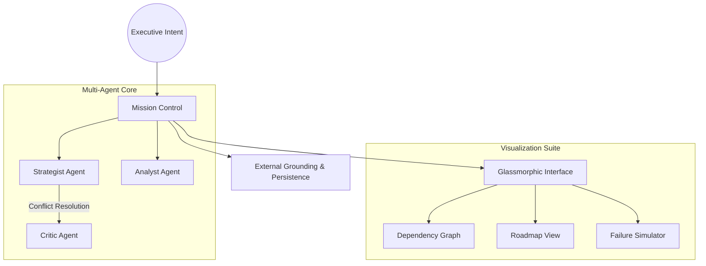

# 🌌 Atlas Strategic Agent V3.1.0

**Atlas** is an elite **Autonomous Strategic Agent** designed to bridge the gap between high-level executive intent and actionable enterprise roadmaps. Powered by a multi-agent collaborative core and a premium glassmorphic interface, Atlas doesn't just decompose tasks—it orchestrates intelligence.

> **The Atlas Vision:** Traditional project management is reactive. Atlas is proactive. By utilizing a decoupled Agent Development Kit (ADK), Atlas simulates the entire lifecycle of a goal before the first task is even assigned, solving the "complexity debt" of long-term planning.

---

## 🚀 Key Innovation Pillars

### 🧠 Multi-Agent Collaborative Synthesis (MACS)

Atlas operates through a triumvirate of specialized personas orchestrated by a decoupled **Agent Development Kit (ADK)**. These agents debate and refine the roadmap:

* **The Strategist**: Architect of goal decomposition and recursive logic flows.
* **The Analyst**: Feasibility expert focused on data grounding and verification.
* **The Critic**: Risk assessor who identifies missing dependencies and failure points.

### 📉 Strategic Visualization Suite

* **Live Dependency Graph**: High-performance **XYFlow (React Flow)** visualization using a Directed Acyclic Graph (DAG) to map the critical path.
* **GANTT Timeline**: A chronological roadmap view powered by **Framer Motion** for seamless temporal tracking.
* **What-If Simulation**: A predictive engine that models mission failure cascades and calculates real-time risk scores.

### 🎨 Enterprise Design System

* **Glassmorphism**: Advanced frosted-glass aesthetics with nested blur layers for a focused, low-cognitive-load UI.
* **Motion Orchestration**: Fluid layout transitions and high-fidelity iconography via **Lucide**.

---

## 🛠 System Architecture



---

## 💻 Tech Stack

* **Core Intelligence**: Gemini 1.5 Flash (Optimized for long-context strategic reasoning)
* **Frontend**: React 19 + Vite (Next-gen performance)
* **Visualization**: React Flow / XYFlow & Framer Motion
* **Styling**: Tailwind CSS + Lucide Icons
* **Type Safety**: 100% Strict TypeScript (Zero-Any Architecture)

---

## 🏃 Getting Started

### 1. Prerequisites

* **Node.js**: v18.0.0+
* **API Access**: Google AI Studio API Key

### 2. Installation & Setup

```bash
# Install dependencies
npm install

# Configure environment
echo "VITE_GEMINI_API_KEY=your_api_key_here" > .env

# Launch the engine
npm run dev

```

---

## 🗺 Roadmap

* [x] **V3.1.0 Core Release**: Multi-Agent Synthesis & Glassmorphic UI.
* [x] **Predictive Simulation**: Real-time "What-If" failure modeling.
* [ ] **V3.2.0 Ecosystem**: Direct GitHub/Jira Issue Sync.
* [ ] **V4.0.0 Collaboration**: Real-time multi-user strategic planning.

---

*Atlas Strategic Agent is a product of the Advanced Agentic Coding initiative.*
