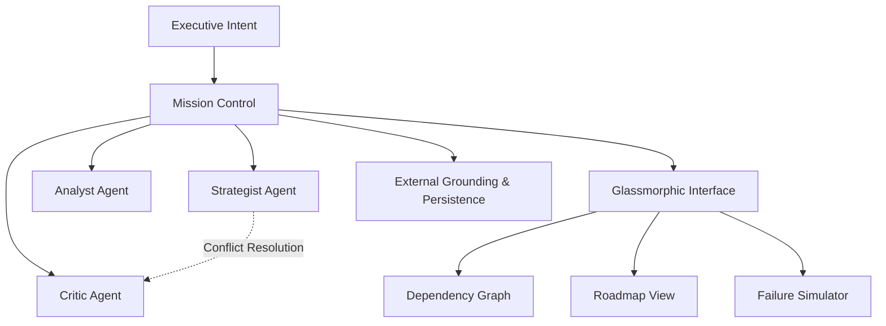

# 🌌 Atlas Strategic Agent V3.1.1

Atlas is an elite **Autonomous Strategic Agent** designed to bridge the gap between high-level executive intent and actionable enterprise roadmaps. Powered by a multi-agent collaborative core and a premium glassmorphic interface, it doesn't just decompose tasks—it orchestrates intelligence.

## 📖 Executive Summary

Traditional project management is **reactive**, relying on manual updates and retrospective risk assessment. **Atlas** is **proactive**. Utilizing a decoupled **Agent Development Kit (ADK)**, Atlas simulates the entire lifecycle of a goal before the first task is assigned. By leveraging the **Google Gemini 1.5 Flash API**, Atlas transforms abstract "moonshot" goals into structured, multi-year roadmaps with high-fidelity visual dependency mapping.

## 🚀 Key Innovation Pillars

### 🧠 Multi-Agent Collaborative Synthesis (MACS)

Atlas operates through a triumvirate of specialized personas that debate and refine every roadmap: **The Strategist** serves as the architect of goal decomposition and recursive logic flows; **The Analyst** functions as a feasibility expert focused on data grounding and verification; and **The Critic** acts as a risk assessor who identifies missing dependencies and failure points.

### 📉 Strategic Visualization Engine

The system includes a **Live Dependency Graph** with interactive XYFlow-based visualization featuring glassmorphic nodes representing the critical path. A **GANTT Timeline** provides chronological roadmap views powered by Framer Motion for seamless temporal tracking. The **What-If Simulation** serves as a predictive engine that models mission failure cascades and calculates real-time risk scores.

### 🎨 Enterprise Design System

The interface leverages **glassmorphism** with advanced frosted-glass aesthetics and nested blur layers for a focused, low-cognitive-load UI. **Motion orchestration** enables fluid layout transitions complemented by professional vector iconography via Lucide.

## 🛠 System Architecture



## 💻 Technical Specification

| Component | Technology |
|-----------|-----------|
| **Core Intelligence** | Gemini 1.5 Flash (Optimized Reasoning) |
| **Frontend Framework** | React 19 + Vite |
| **Animation Engine** | Framer Motion |
| **Visualization** | React Flow / XYFlow |
| **Type Safety** | 100% Strict TypeScript (Zero-Any) |
| **Styling** | Tailwind CSS + Lucide Icons |

## 🕹 Getting Started

### Prerequisites

- **Node.js**: v20.0.0+ (LTS recommended)
- **API Access**: Google AI Studio API Key

### Installation

```bash
# Clone the repository
git clone https://github.com/yourusername/atlas-strategic-agent.git
cd atlas-strategic-agent

# Install dependencies
npm install
```

### Configuration

Create a `.env` file in the root directory:

```env
VITE_GEMINI_API_KEY=your_api_key_here
```

### Execution

```bash
# Start development server
npm run dev

# Build for production
npm run build

# Preview production build
npm run preview
```

## 🗺 Roadmap

- [x] **Multi-Agent Synthesis Engine**: Decoupled ADK implementation
- [x] **Predictive Failure Simulation**: Real-time risk scoring and cascade modeling
- [x] **V3.1.1 Maintenance**: Resolved build system BOM issues and type safety
- [ ] **V3.2.0 Sync Integration**: Direct GitHub/Jira issue synchronization
- [ ] **V4.0.0 Collaboration**: Real-time multi-user collaborative planning

## 📄 License

This project is part of the Advanced Agentic Coding initiative.

## 🤝 Contributing

Contributions are welcome! Please feel free to submit a Pull Request.

## 📞 Support

For issues and feature requests, please use the GitHub Issues page.

---

*Atlas Strategic Agent - Transforming executive vision into executable strategy.*
