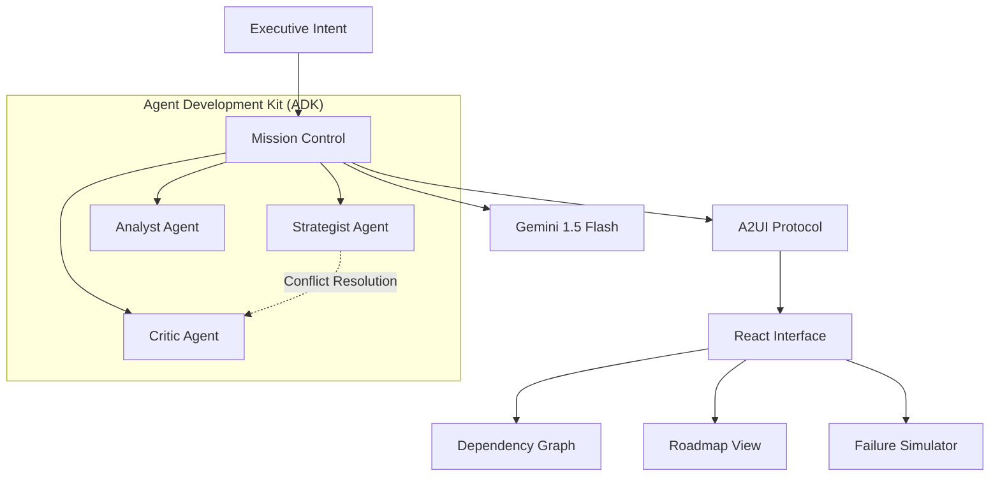

# 🌌 Atlas Strategic Agent V3.1.5


**Atlas** is an elite **Autonomous Strategic Agent** designed to bridge the gap between high-level executive intent and actionable enterprise roadmaps. Powered by a multi-agent collaborative core and a premium glassmorphic interface, it doesn't just decompose tasks—it orchestrates intelligence.

---

## 📖 Executive Summary

Traditional project management is **reactive**. **Atlas** is **proactive**.

Utilizing a decoupled **Agent Development Kit (ADK)** and the **A2UI Protocol**, Atlas simulates the entire lifecycle of a goal before the first task is assigned. By leveraging the **Google Gemini 1.5 Flash API**, it transforms abstract "moonshot" goals into structured, multi-year roadmaps with high-fidelity visual dependency mapping and real-time risk simulation.

## 🚀 Key Innovation Pillars

### 🧠 Multi-Agent Collaborative Synthesis (MACS)
Atlas operates through a triumvirate of specialized personas that debate and refine every roadmap:
- **The Strategist**: Architect of goal decomposition and recursive logic flows.
- **The Analyst**: Feasibility expert focused on data grounding and verification.
- **The Critic**: Risk assessor who identifies missing dependencies and failure points.

### 🔌 A2UI Protocol (Agent-to-User Interface)
Atlas features a proprietary **A2UI Protocol** that allows agents to natively render UI components (Glassmorphic Cards, Progress Bars, Charts) directly from the LLM stream. This enables dynamic, context-aware interfaces that adapt to the conversation.

### 📉 Strategic Visualization Engine
- **Live Dependency Graph**: Interactive XYFlow-based visualization with glassmorphic nodes representing the critical path.
- **What-If Simulation**: A predictive engine that models mission failure cascades and calculates complex risk scores in real-time.

### 🎨 Enterprise Design System
- **Optimized Glassmorphism**: High-performance local CSS build (Tailwind + PostCSS) delivering deep frosted-glass aesthetics with zero runtime overhead.
- **Motion Orchestration**: Fluid layout transitions via Framer Motion.

## 🛠 System Architecture



## 💻 Technical Specification

| Component | Technology | Description |
|-----------|-----------|-------------|
| **Core Intelligence** | Gemini 1.5 Flash | Optimized reasoning engine via `src/services/geminiService.ts` |
| **Frontend Framework** | React 19 + Vite | Next-gen reactivity and build speed |
| **Styling** | Tailwind CSS 3.4 | Locally bundled, minified glassmorphism engine |
| **Visualization** | XYFlow | Interactive node-based graph rendering |
| **State Management** | React Hooks | Lean, component-level state orchestration |
| **Protocols** | A2UI / JSON | Structured agent communication standard |

## 🕹 Getting Started

### Prerequisites

- **Node.js**: v20.0.0+ (LTS recommended)
- **API Access**: Google Vertex AI / AI Studio API Key

### Installation

```bash
# Clone the repository
git clone https://github.com/darshil0/atlas-strategic-agent.git
cd atlas-strategic-agent

# Install dependencies (Clean install)
npm ci
```

### Configuration

Create a `.env` file in the root directory (based on `.env.example` if available). **This is critical** for the AI agents to function.

```env
VITE_GEMINI_API_KEY=your_api_key_here
```

### Execution

```bash
# Start development server
npm run dev

# Build for production
npm run build

# Preview production build
npm run preview
```

### Testing Strategy

Atlas includes a robust smoke test suite to verify ADK integrity.

```bash
# Run test suite
npm test

# Run linting (Strict Type Checking)
npm run lint
```

## 📂 Project Structure

```text
src/
├── components/       # React UI Components (TaskCard, DependencyGraph)
├── config/           # Centralized Configuration (Env, System Prompts)
├── lib/
│   └── adk/          # Agent Development Kit (Agents, Factory, Protocol)
├── services/         # External Services (Gemini, Persistence)
├── types/            # TypeScript Definitions
├── index.css         # Global Styles & Tailwind Directives
└── App.tsx           # Main Application Entry
```

## 🗺 Roadmap

- [x] **V3.1.5**: Performance Overhaul (Local CSS Integration)
- [x] **V3.1.4**: Runtime Hardening (Safe JSON Parsing & Env Validation)
- [x] **Multi-Agent Synthesis**: Decoupled ADK implementation
- [ ] **V3.2.0 Sync**: Direct GitHub/Jira connector
- [ ] **V4.0.0 Collaboration**: Real-time multi-user planning (WebSockets)

## 📄 License

This project is part of the **Advanced Agentic Coding** initiative.

---

*Atlas Strategic Agent - Transforming executive vision into executable strategy.*
