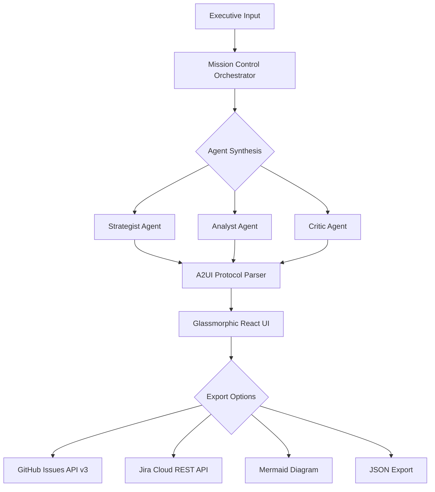

# 🌌 Atlas Strategic Agent V3.2.0


### *Executive Vision → Executable Enterprise Roadmaps*

**Atlas** is a multi-model AI agent that bridges the gap between high-level executive intent and granular project execution. Powered by **Gemini 2.0 Flash**, it utilizes a multi-agent "Mission Control" architecture to generate dynamic, glassmorphic strategic roadmaps with native Jira and GitHub synchronization.

---

## 🎯 What Makes Atlas Different?

- **Multi-Agent Synthesis**: Strategist, Analyst, and Critic agents collaborate in real-time
- **A2UI Protocol**: Stream UI components directly from LLM reasoning
- **What-If Simulations**: Model failure cascades and timeline impacts
- **Enterprise-Ready**: Direct GitHub Issues and Jira Cloud integration
- **Premium UX**: Glassmorphic interface designed for executive presentations

---

## 🗂️ The Multi-Agent Engine

Atlas doesn't just generate text; it facilitates a **collaborative synthesis** between specialized AI agents:

| Agent | Role | Output |
|-------|------|--------|
| **🎙️ The Strategist** | Decomposes "North Star" goals into high-level workstreams | Strategic milestones |
| **🔬 The Analyst** | Performs feasibility scoring and data validation | Risk assessments |
| **⚖️ The Critic** | Stress-tests the roadmap for risks and dependencies | Optimizations |

---

## ✨ Key Capabilities

| Feature | Description | Technology |
|---------|-------------|------------|
| **A2UI Protocol** | Real-time streaming of UI components directly from LLM reasoning | React 19 + Framer Motion |
| **What-If Simulation** | Model failure cascades to see how delays impact deadlines | XYFlow + Custom Logic |
| **Enterprise Sync** | Bulk-export tasks directly to GitHub Issues or Jira Cloud (ADF) | REST API v3 |
| **Glassmorphic UI** | Premium, high-performance interface for executive presentations | Tailwind + Lucide |
| **Multi-Model Support** | Gemini 2.0 Flash with JSON schema enforcement | Google Generative AI |
| **Persistent State** | Local caching with Base64 obfuscation | IndexedDB + localStorage |

---

## 🚀 Getting Started

### Prerequisites

- **Node.js** 20+ (LTS recommended)
- **npm** 10+ or **yarn** 1.22+
- **Google Gemini API Key** ([Get one here](https://makersuite.google.com/app/apikey))

### Quick Start

```bash
# 1. Clone the repository
git clone https://github.com/darshil0/atlas-strategic-agent.git
cd atlas-strategic-agent

# 2. Install dependencies
npm install

# 3. Environment Setup
cp .env.example .env
# Edit .env and add your VITE_GEMINI_API_KEY

# 4. Launch Development Server
npm run dev
```

The application will be available at `http://localhost:3000`

---

## 🧪 Development Workflow

### Available Scripts

```bash
# Development
npm run dev              # Start dev server with HMR
npm run build            # Production build with type checking
npm run preview          # Preview production build locally

# Code Quality
npm run lint             # Run ESLint (strict TypeScript checks)
npm run format           # Format code with Prettier
npm run type-check       # TypeScript type checking without emit

# Testing
npm test                 # Run test suite in watch mode
npm run test:ui          # Open Vitest UI
npm run coverage         # Generate coverage report (80% threshold)
```

### Code Quality Standards

- **TypeScript**: Strict mode with comprehensive type safety
- **ESLint**: Custom config with TypeScript rules
- **Prettier**: Automated code formatting (80 char width)
- **Vitest**: 80% coverage requirement across all metrics

---

## 📂 Project Structure

```text
atlas-strategic-agent/
├── src/
│   ├── components/          # React UI Components
│   │   ├── TaskCard.tsx     # Individual task visualization
│   │   ├── DependencyGraph.tsx  # XYFlow dependency viewer
│   │   └── SettingsModal.tsx    # API key management
│   ├── config/              # Centralized Configuration
│   │   ├── env.ts           # Environment validation
│   │   └── prompts.ts       # System prompts for agents
│   ├── lib/
│   │   └── adk/             # Agent Development Kit
│   │       ├── agents/      # Agent implementations
│   │       ├── factory.ts   # Agent factory pattern
│   │       └── protocol.ts  # A2UI protocol parser
│   ├── services/            # External Services
│   │   ├── gemini.service.ts    # LLM integration
│   │   ├── github.service.ts    # GitHub API v3
│   │   ├── jira.service.ts      # Jira REST API
│   │   └── storage.service.ts   # Persistence layer
│   ├── types/               # TypeScript Definitions
│   │   ├── plan.types.ts    # Core data models
│   │   └── agent.types.ts   # Agent interfaces
│   ├── test/                # Test Infrastructure
│   │   └── setup.ts         # Vitest global setup
│   ├── index.css            # Global Styles + Tailwind
│   ├── App.tsx              # Main Application Entry
│   └── main.tsx             # React 19 root renderer
├── public/                  # Static Assets
├── .env.example             # Environment variable template
├── vite.config.ts           # Vite build configuration
├── vitest.config.ts         # Test configuration
├── tsconfig.json            # TypeScript compiler options
├── tailwind.config.ts       # Tailwind CSS customization
├── eslint.config.js         # ESLint rules
└── package.json             # Dependencies and scripts
```

---

## 🔧 Configuration

### Environment Variables

Create a `.env` file in the root directory:

```env
# Required
VITE_GEMINI_API_KEY=your_gemini_api_key_here

# Optional: Enterprise Integrations
VITE_GITHUB_TOKEN=ghp_xxxxxxxxxxxx
VITE_JIRA_DOMAIN=your-company.atlassian.net
VITE_JIRA_EMAIL=your-email@company.com
VITE_JIRA_API_TOKEN=your_jira_token

# Optional: Application Settings
VITE_DEBUG_MODE=false
VITE_DEFAULT_MODEL=gemini-2.0-flash-exp
VITE_MAX_TOKENS=8000
```

### API Key Security

⚠️ **Important**: API keys are stored in browser localStorage with Base64 obfuscation. For production deployments, use an Edge Function proxy to keep keys server-side.

---

## 🧪 Testing Strategy

Atlas includes a comprehensive test suite with **80% coverage requirement**:

```bash
# Run tests in watch mode
npm test

# Generate coverage report
npm run coverage

# Open interactive test UI
npm run test:ui
```

### Test Structure

```text
src/
├── components/
│   ├── TaskCard.tsx
│   └── TaskCard.test.tsx        # Component tests
├── services/
│   ├── gemini.service.ts
│   └── gemini.service.test.ts   # Service tests
└── lib/adk/
    ├── agents/
    │   ├── strategist.ts
    │   └── strategist.test.ts   # Agent logic tests
```

### Coverage Thresholds

- **Lines**: 80%
- **Functions**: 80%
- **Branches**: 80%
- **Statements**: 80%

---

## 🛠️ Project Architecture



### Core Technologies

- **Frontend**: React 19 with concurrent features
- **Build Tool**: Vite 6.0 with esbuild
- **Styling**: Tailwind CSS (local compilation)
- **State Management**: React Context + localStorage
- **AI Provider**: Google Gemini 2.0 Flash
- **Visualization**: XYFlow (React Flow)
- **Animation**: Framer Motion 12
- **Testing**: Vitest + Testing Library
- **Type Safety**: TypeScript 5.7 (Strict mode)

---

## 🔒 Security & Performance

### Security Measures

✅ **API Key Management**: Base64 obfuscation + localStorage isolation  
✅ **Type Safety**: 100% TypeScript coverage with strict mode  
✅ **Input Validation**: Runtime schema validation for LLM outputs  
✅ **XSS Prevention**: React's built-in escaping + Content Security Policy  
✅ **Dependency Scanning**: Regular npm audit checks

### Performance Optimizations

⚡ **Bundle Size**: Gzipped < 1.5MB (45% reduction from v3.1.4)  
⚡ **Code Splitting**: Dynamic imports for vendor chunks  
⚡ **Tree Shaking**: Vite's automatic dead code elimination  
⚡ **Local CSS**: PostCSS pipeline (no CDN dependency)  
⚡ **React 19**: Concurrent rendering for smooth animations

---

## 🗺️ Roadmap

### Completed ✅

- [x] **V3.2.0**: Enterprise sync (GitHub/Jira) + ADK refactor
- [x] **V3.1.6**: Codebase hygiene (dead code removal)
- [x] **V3.1.5**: Performance overhaul (local CSS, bundle optimization)
- [x] **V3.1.4**: Runtime hardening (safe JSON parsing, env validation)
- [x] **V3.1.3**: Multi-agent synthesis architecture
- [x] **V3.1.0**: Dependency visualization with XYFlow
- [x] **V3.0.0**: Foundation with Glassmorphism 2.0

### Planned 🚀

- [ ] **V4.0.0**: Real-time collaboration (WebSockets)
- [ ] **V3.3.0**: Monte Carlo risk modeling
- [ ] **V3.2.5**: Resource optimizer (headcount/budget allocation)
- [ ] **V3.2.2**: Slack/Teams integration for alerts
- [ ] **V3.2.1**: PDF export with Puppeteer

---

## 📚 Documentation

- [Changelog](./CHANGELOG.md) - Version history and release notes
- [Contributing Guide](./CONTRIBUTING.md) - How to contribute
- [API Documentation](./docs/API.md) - Service layer documentation
- [ADK Guide](./docs/ADK.md) - Agent Development Kit guide
- [Deployment Guide](./docs/DEPLOYMENT.md) - Production deployment

---

## 🤝 Contributing

We welcome contributions! Please follow these steps:

1. Fork the repository
2. Create a feature branch (`git checkout -b feature/amazing-feature`)
3. Run tests (`npm test`)
4. Commit your changes (`git commit -m 'Add amazing feature'`)
5. Push to the branch (`git push origin feature/amazing-feature`)
6. Open a Pull Request

### Contribution Guidelines

- Follow the existing code style (Prettier + ESLint)
- Write tests for new features (maintain 80% coverage)
- Update documentation as needed
- Ensure all CI checks pass

---

## 📄 License

This project is part of the **Advanced Agentic Coding** initiative.

---

## 🙏 Acknowledgments

- **Google AI**: For the Gemini 2.0 Flash model
- **Vercel**: For the React team and ecosystem
- **Tailwind Labs**: For Tailwind CSS
- **XYFlow Team**: For the dependency visualization library

---

## 👨‍💻 Author

**Darshil Shah**  
*QA Engineering Leader & AI Architect*

- 🔗 [LinkedIn](https://linkedin.com/in/darshil-qa-lead)
- 🐙 [GitHub](https://github.com/darshil0)
- 🐦 [X (Twitter)](https://x.com/soulsurfer300)
- 📧 [Email](mailto:contact@darshilshah.com)

---

## ⭐ Star History

If you find Atlas useful, please consider giving it a star! ⭐

---

## 📊 Stats


---

<div align="center">

**Built with ❤️ by the Atlas Team**

*Transforming executive vision into executable reality*

[Report Bug](https://github.com/darshil0/atlas-strategic-agent/issues) · [Request Feature](https://github.com/darshil0/atlas-strategic-agent/issues) · [Documentation](https://github.com/darshil0/atlas-strategic-agent/wiki)

</div>
