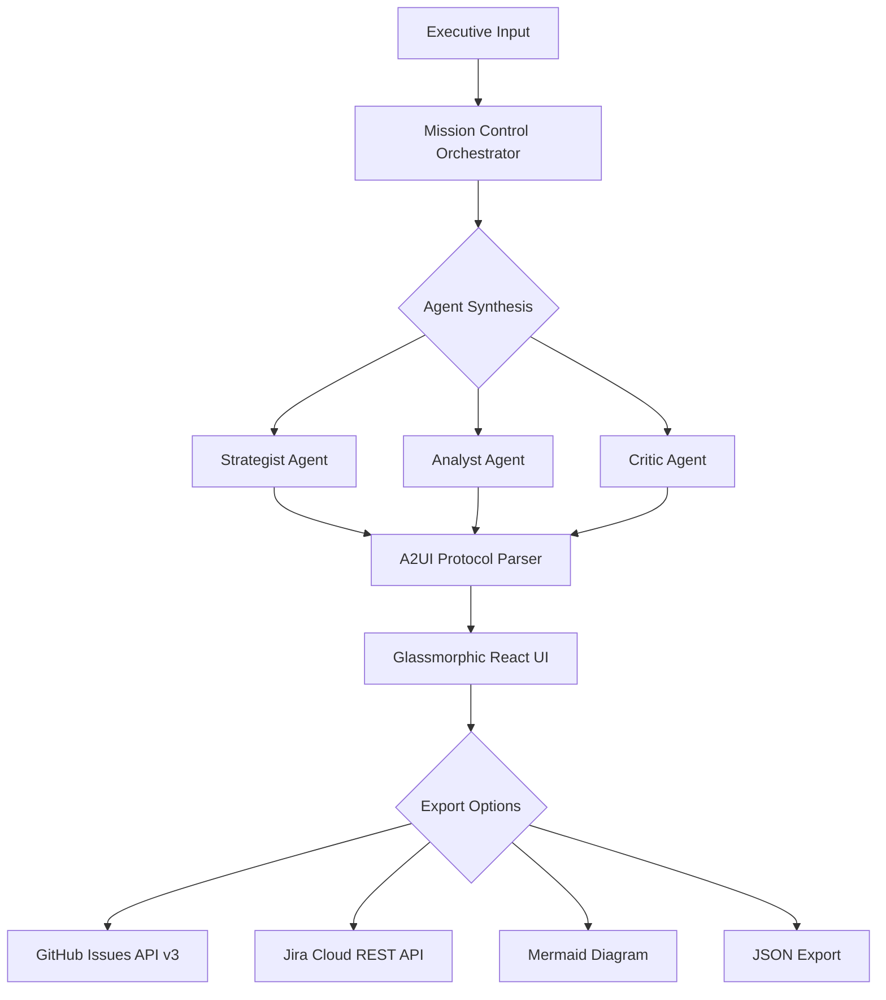

# 🌌 Atlas Strategic Agent V3.2.4


### *Executive Vision → Executable Enterprise Roadmaps*

**Atlas** is a multi-model AI agent that bridges the gap between high-level executive intent and granular project execution. Powered by **Gemini 2.0 Flash**, it utilizes a multi-agent "Mission Control" architecture to generate dynamic, glassmorphic strategic roadmaps with native Jira and GitHub synchronization.

---

## 🎯 What Makes Atlas Different?

- **Multi-Agent Synthesis** - Strategist, Analyst, and Critic agents collaborate in real-time
- **A2UI Protocol** - Stream UI components directly from LLM reasoning
- **What-If Simulations** - Model failure cascades and timeline impacts
- **Enterprise-Ready** - Direct GitHub Issues and Jira Cloud integration
- **Premium UX** - Glassmorphic interface designed for executive presentations

---

## 🗂️ The Multi-Agent Engine

Atlas doesn't just generate text; it facilitates a **collaborative synthesis** between specialized AI agents:

| Agent | Role | Output |
|-------|------|--------|
| **🎙️ The Strategist** | Decomposes "North Star" goals into high-level workstreams | Strategic milestones |
| **🔬 The Analyst** | Performs feasibility scoring and data validation | Risk assessments |
| **⚖️ The Critic** | Stress-tests the roadmap for risks and dependencies | Optimizations |

---

## ✨ Key Capabilities

| Feature | Description | Technology |
|---------|-------------|------------|
| **A2UI Protocol** | Real-time streaming of UI components directly from LLM reasoning | React 19 + Framer Motion |
| **What-If Simulation** | Model failure cascades to see how delays impact deadlines | XYFlow + Custom Logic |
| **Enterprise Sync** | Bulk-export tasks directly to GitHub Issues or Jira Cloud (ADF) | REST API v3 |
| **Glassmorphic UI** | Premium, high-performance interface for executive presentations | Tailwind + Lucide |
| **Multi-Model Support** | Gemini 2.0 Flash with JSON schema enforcement | Google Generative AI |
| **Persistent State** | Local caching with Base64 obfuscation | persistenceService + localStorage |

---

## 🚀 Getting Started

### Prerequisites

- **Node.js** 20+ (LTS recommended)
- **npm** 10+ or **yarn** 1.22+
- **Google Gemini API Key** ([Get one here](https://makersuite.google.com/app/apikey))

### Quick Start

```bash
# 1. Clone the repository
git clone https://github.com/darshil0/atlas-strategic-agent.git
cd atlas-strategic-agent

# 2. Install dependencies
npm install

# 3. Environment Setup
cp .env.example .env
# Edit .env and add your VITE_GEMINI_API_KEY

# 4. Launch Development Server
npm run dev
```

The application will be available at `http://localhost:3000`.

---

## 🧪 Development Workflow

### Available Scripts

```bash
# Development
npm run dev              # Start dev server with HMR
npm run build            # Production build with type checking
npm run preview          # Preview production build locally

# Code Quality
npm run lint             # Run ESLint (strict TypeScript checks)
npm run format           # Format code with Prettier
npm run type-check       # TypeScript type checking without emit

# Testing
npm test                 # Run test suite in watch mode
npm run test:ui          # Open Vitest UI
npm run coverage         # Generate coverage report (80% threshold)
```

### Code Quality Standards

- **TypeScript** - Strict mode with comprehensive type safety
- **ESLint** - Custom config with TypeScript rules
- **Prettier** - Automated code formatting (80 char width)
- **Vitest** - 80% coverage requirement across all metrics

---

## 📂 Project Structure

```text
atlas-strategic-agent/
├── src/
│   ├── components/              # React UI Components
│   ├── config/                  # Centralized Configuration
│   ├── data/                    # Static Data & Templates
│   ├── lib/
│   │   └── adk/                 # Agent Development Kit
│   ├── services/                # External Services
│   ├── types/                   # TypeScript Definitions
│   ├── test/                    # Test Infrastructure
│   ├── index.css                # Global Styles + Tailwind
│   ├── App.tsx                  # Main Application Entry
│   └── main.tsx                 # React 19 root renderer
├── public/                      # Static Assets
├── .env.example                 # Environment variable template
├── vite.config.ts               # Vite build configuration
├── vitest.config.ts             # Test configuration
├── tsconfig.json                # TypeScript compiler options
├── tailwind.config.ts           # Tailwind CSS customization
├── eslint.config.js             # ESLint rules
└── package.json                 # Dependencies and scripts
```

---

## 🛠️ Project Architecture



---

## 🗺️ Roadmap

### Completed ✅

- [x] **V3.2.4** - Initial enterprise release: Multi-agent synthesis, A2UI, XYFlow, and GitHub/Jira sync.

### Planned 🚀

- [ ] **V4.0.0** - Monte Carlo risk modeling
- [ ] **V4.1.0** - Real-time collaboration (WebSockets)
- [ ] **V4.2.0** - Resource optimizer (headcount/budget allocation)

---

## 📚 Documentation

- [Changelog](./CHANGELOG.md) - Version history and release notes
- [Contributing Guide](./CONTRIBUTING.md) - How to contribute

---

## 📄 License

This project is part of the **Advanced Agentic Coding** initiative.

---

## 🙏 Acknowledgments

- **Google AI** - For the Gemini 2.0 Flash model
- **Vercel** - For the React ecosystem
- **Tailwind Labs** - For Tailwind CSS
- **XYFlow Team** - For the dependency visualization library

---

## 👨‍💻 Author

**Darshil Shah**  
*QA Engineering Leader & AI Architect*

- 🔗 [LinkedIn](https://linkedin.com/in/darshil-qa-lead)
- 🐙 [GitHub](https://github.com/darshil0)
- 🐦 [X (Twitter)](https://x.com/soulsurfer300)
- 📧 [Email](mailto:contact@darshilshah.com)

---

<div align="center">

**Built with ❤️ by Darshil**

*Transforming executive vision into executable reality*

[Report Bug](https://github.com/darshil0/atlas-strategic-agent/issues) · [Request Feature](https://github.com/darshil0/atlas-strategic-agent/issues) · [Documentation](https://github.com/darshil0/atlas-strategic-agent/wiki)

</div>
