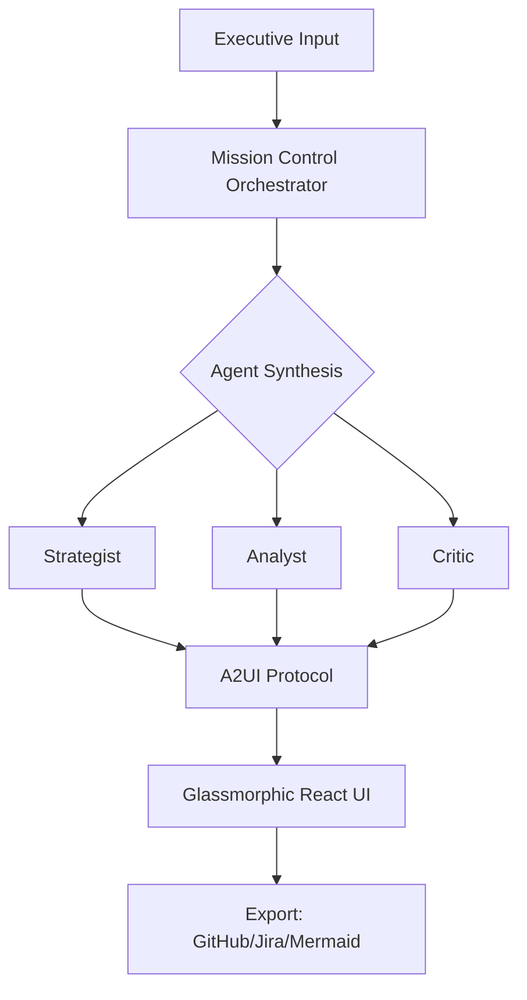

# 🌌 Atlas Strategic Agent
### *Executive Vision → Executable Enterprise Roadmaps*
**Atlas** is an AI-native orchestration platform that bridges the gap between high-level executive intent and granular project execution. Powered by **Gemini 2.0 Flash**, it utilizes a multi-agent "Mission Control" to generate dynamic, glassmorphic strategic roadmaps with native Jira and GitHub synchronization.

---

## 🏗️ The Multi-Agent Engine
Atlas doesn't just generate text; it facilitates a **collaborative synthesis** between specialized AI agents:

* **🎙️ The Strategist**: Decomposes "North Star" goals into high-level workstreams.
* **🔬 The Analyst**: Performs feasibility scoring and data validation.
* **⚖️ The Critic**: Stress-tests the roadmap for risks and suggests "What-If" optimizations.

---

## ✨ Key Capabilities

| Feature | Description | Tech |
|---------|-------------|------|
| **A2UI Protocol** | Real-time streaming of UI components directly from LLM reasoning. | React 19 + Framer Motion |
| **What-If Simulation** | Model failure cascades to see how a single delay impacts the Q2 2026 deadline. | XYFlow + Custom Logic |
| **Enterprise Sync** | Bulk-export generated tasks directly to GitHub Issues or Jira Cloud (ADF). | REST API v3 |
| **Glassmorphic UI** | Premium, high-performance interface designed for executive presentations. | Tailwind + Lucide |

---

## 🚀 Getting Started

### Prerequisites
* Node.js 20+
* A Google Gemini API Key

### Installation
```bash
# 1. Clone the repository
git clone https://github.com/darshil0/atlas-strategic-agent.git
cd atlas-strategic-agent

# 2. Install dependencies
npm install

# 3. Environment Setup
echo "VITE_GEMINI_API_KEY=your_api_key_here" > .env

# 4. Launch Development Server
npm run dev
```

---

## 🛠 Project Architecture



### Directory Structure Highlights
* `src/lib/adk/`: The **Agent Development Kit**—contains the core logic for agent factories and the A2UI protocol.
* `src/services/`: Direct integrations for Gemini, GitHub, and Jira.
* `src/components/`: Atomic UI components following the **Glassmorphism 2.0** design system.

---

## 🔒 Security & Performance
* **Key Management**: API keys are obfuscated and stored in `localStorage`. For production, it is recommended to use an Edge Function proxy.
* **Bundle Optimization**: Leverages Vite's tree-shaking and local Tailwind compilation to keep the gzipped bundle under **1.5MB**.
* **React 19**: Uses the latest concurrent rendering features for a stutter-free "What-If" simulation experience.

---

## 👨‍💻 Author
**Darshil Shah** – *QA Engineering Leader & AI Architect*

[LinkedIn](https://linkedin.com/in/darshil-qa-lead) | [GitHub](https://github.com/darshil0) | [X](https://x.com/soulsurfer300)
