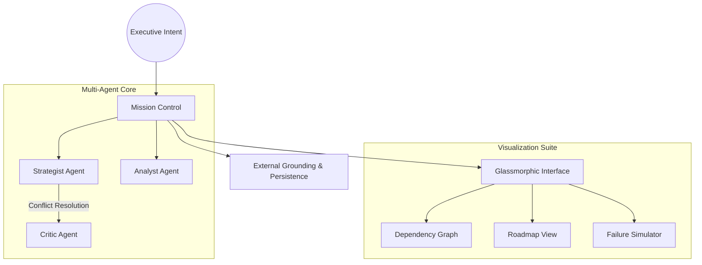

# 🌌 Atlas Strategic Agent V3.1.0

### *The Architect of Ambition*

**Atlas V3.1.0** is an elite **Autonomous Strategic Agent** designed to bridge the gap between high-level executive intent and actionable enterprise roadmaps. Powered by a multi-agent collaborative core and a premium glassmorphic interface, it doesn't just decompose tasks—it orchestrates intelligence.

---

## 📖 Executive Summary

Traditional project management is **reactive**, relying on human updates and manual risk assessment. **Atlas** is **proactive**. It utilizes a decoupled Agent Development Kit (ADK) to simulate the entire lifecycle of a goal before the first task is assigned. By leveraging the **Google Gemini API**, Atlas transforms abstract "moonshot" goals into structured, multi-year roadmaps with visual dependency mapping.

---

## 🚀 Key Innovation Pillars

### 🧠 Multi-Agent Collaborative Synthesis (MACS)

Atlas operates through a triumvirate of specialized personas that debate and refine every roadmap:

* **The Strategist**: Architect of goal decomposition and recursive logic flows.
* **The Analyst**: Feasibility expert focused on data grounding and verification.
* **The Critic**: Risk assessor who identifies missing dependencies and failure points.

### 📉 Strategic Visualization Engine

* **Live Dependency Graph**: Interactive **XYFlow-based** visualization with high-fidelity glassmorphic nodes representing the critical path.
* **GANTT Timeline**: A chronological roadmap view powered by **Framer Motion** for seamless temporal tracking.
* **What-If Simulation**: A predictive engine that models mission failure cascades and calculates real-time risk scores.

### 🎨 Enterprise Design System

* **Glassmorphism**: Advanced frosted-glass aesthetics with nested blur layers for a focused, low-cognitive-load UI.
* **Motion Orchestration**: Fluid layout transitions and professional vector iconography via **Lucide**.

---

## 🛠 System Architecture



---

## 💻 Technical Specification

| Component | Technology |
| --- | --- |
| **Core Intelligence** | Gemini 1.5 Flash (Optimized for strategic reasoning) |
| **Frontend Framework** | React 19 + Vite |
| **Animation Engine** | Framer Motion |
| **Visualization** | React Flow / XYFlow |
| **Styling** | Tailwind CSS + Lucide Icons |
| **Type Safety** | 100% Strict TypeScript (Zero-Any Architecture) |

---

## 🏃 Getting Started

### Prerequisites

* **Node.js**: v19.0.0
* **API Access**: Google AI Studio API Key

### Installation

```bash
npm install

```

### Configuration

Create a `.env` file in the root directory:

```env
VITE_GEMINI_API_KEY=your_api_key_here

```

### Execution

```bash
npm run dev

```

---

## 🗺 Roadmap

* [x] **Multi-Agent Synthesis Engine**: Decoupled ADK implementation.
* [x] **Predictive Failure Simulation**: Real-time risk scoring and cascade modeling.
* [x] **V3.1.0 Core Release**: Full Glassmorphic UI overhaul.
* [ ] **V3.2.0 Sync Integration**: Direct GitHub/Jira Issue synchronization.
* [ ] **V4.0.0 Collaboration**: Real-time multi-user collaborative planning.

---

*Atlas Strategic Agent is a product of the Advanced Agentic Coding initiative.*
