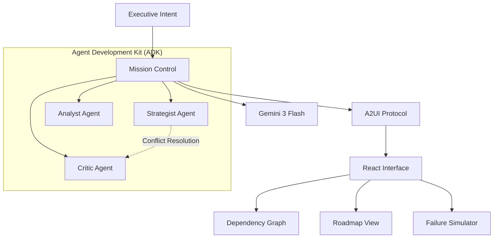

# 🌌 Atlas Strategic Agent V3.2.0


**Atlas** is an elite **Autonomous Strategic Agent** designed to bridge the gap between high-level executive intent and actionable enterprise roadmaps. Powered by a multi-agent collaborative core and a premium glassmorphic interface, it doesn't just decompose tasks—it orchestrates intelligence.

---

## 📖 Executive Summary

Traditional project management is **reactive**. **Atlas** is **proactive**.

Utilizing a decoupled **Agent Development Kit (ADK)** and the **A2UI Protocol**, Atlas simulates the entire lifecycle of a goal before the first task is assigned. By leveraging the **Google Gemini 3 Flash API**, it transforms abstract "moonshot" goals into structured, multi-year roadmaps with high-fidelity visual dependency mapping and real-time risk simulation.

---

## 🚀 Key Innovation Pillars

### 🧠 Multi-Agent Collaborative Synthesis (MACS)
Atlas operates through a triumvirate of specialized personas that debate and refine every roadmap:
- **The Strategist**: Architect of goal decomposition and recursive logic flows.
- **The Analyst**: Feasibility expert focused on data grounding and verification.
- **The Critic**: Risk assessor who identifies missing dependencies and failure points.

### 🔌 A2UI Protocol (Agent-to-User Interface)
Atlas features a proprietary **A2UI Protocol** that allows agents to natively render UI components (Glassmorphic Cards, Progress Bars, Charts) directly from the LLM stream. This enables dynamic, context-aware interfaces that adapt to the conversation.

### 📉 Strategic Visualization Engine
- **Live Dependency Graph**: Interactive XYFlow-based visualization with glassmorphic nodes representing the critical path.
- **What-If Simulation**: A predictive engine that models mission failure cascades and calculates complex risk scores in real-time.

### 🎨 Enterprise Design System
- **Optimized Glassmorphism**: High-performance local CSS build (Tailwind + PostCSS) delivering deep frosted-glass aesthetics with zero runtime overhead.
- **Motion Orchestration**: Fluid layout transitions via Framer Motion.

---

## 🛠 System Architecture



---

## 💻 Technical Specifications

| Component | Technology | Description |
|-----------|-----------|-------------|
| **Core Intelligence** | Gemini 3 Flash | Optimized reasoning engine via `src/services/geminiService.ts` |
| **Frontend Framework** | React 19 + Vite | Next-gen reactivity and build speed |
| **Styling** | Tailwind CSS 3.4 | Locally bundled, minified glassmorphism engine |
| **Visualization** | XYFlow | Interactive node-based graph rendering |
| **State Management** | React Hooks | Lean, component-level state orchestration |
| **Protocols** | A2UI / JSON | Structured agent communication standard |

---

## 🕹 Getting Started

### Prerequisites

- **Node.js**: v20.0.0+ (LTS recommended)
- **npm**: v10.0.0+
- **API Access**: Google AI Studio API Key ([Get one here](https://makersuite.google.com/app/apikey))

### Installation

```bash
# Clone the repository
git clone https://github.com/darshil0/atlas-strategic-agent.git
cd atlas-strategic-agent

# Install dependencies (Clean install recommended)
npm ci
```

### Configuration

Create a `.env` file in the root directory:

```env
VITE_GEMINI_API_KEY=your_actual_api_key_here
```

**Important**: Replace `your_actual_api_key_here` with your actual Gemini API key from Google AI Studio.

### Execution

```bash
# Start development server
npm run dev

# Build for production
npm run build

# Preview production build
npm run preview
```

### Testing Strategy

Atlas includes a robust smoke test suite to verify ADK integrity.

```bash
# Run test suite
npm test

# Run linting (Strict Type Checking)
npm run lint
```

---

## 📂 Project Structure

```text
atlas-strategic-agent/
├── .vscode/
│   └── settings.json          # IDE configuration for glassmorphic CSS
├── src/
│   ├── components/            # React UI Components
│   │   ├── TaskCard.tsx
│   │   ├── DependencyGraph.tsx
│   │   └── ProgressIndicator.tsx
│   ├── config/
│   │   ├── env.ts             # Environment validation
│   │   └── systemPrompts.ts   # Agent persona definitions
│   ├── lib/
│   │   └── adk/               # Agent Development Kit
│   │       ├── agents/        # Individual agent implementations
│   │       ├── agentFactory.ts
│   │       └── protocol.ts    # A2UI Protocol
│   ├── services/
│   │   ├── geminiService.ts   # Gemini API integration
│   │   └── persistenceService.ts
│   ├── types/
│   │   └── index.ts           # TypeScript definitions
│   ├── index.css              # Global styles + Tailwind directives
│   └── App.tsx                # Main application entry
├── postcss.config.js          # PostCSS configuration
├── tailwind.config.js         # Tailwind CSS configuration
├── vite.config.ts             # Vite build configuration
├── package.json
├── CHANGELOG.md
└── README.md
```

---

## 🎯 Usage Example

1. **Launch Atlas**: Start the development server with `npm run dev`
2. **Enter Strategic Goal**: Input a high-level objective (e.g., "Launch a SaaS platform in 18 months")
3. **Agent Synthesis**: Watch as the Strategist, Analyst, and Critic collaborate to generate a roadmap
4. **Review Roadmap**: Explore the interactive dependency graph and milestone timeline
5. **Simulate Risk**: Use the What-If simulator to test failure scenarios
6. **Export Plan**: Download the roadmap as JSON or visualize in your project management tool

---

## 🗺 Roadmap

- [x] **V3.1.5**: Performance Overhaul (Local CSS Build Integration)
- [x] **V3.1.4**: Runtime Hardening (Safe JSON Parsing & Env Validation)
- [x] **V3.1.3**: Multi-Agent Synthesis (Decoupled ADK Implementation)
- [ ] **V3.2.0**: Direct GitHub/Jira Integration
- [ ] **V4.0.0**: Real-time Multi-User Collaboration (WebSockets)

See [CHANGELOG.md](./CHANGELOG.md) for detailed version history.

---

## 🤝 Contributing

Atlas is part of the **Advanced Agentic Coding** initiative. Contributions are welcome!

1. Fork the repository
2. Create a feature branch (`git checkout -b feature/amazing-feature`)
3. Commit your changes (`git commit -m 'Add amazing feature'`)
4. Push to the branch (`git push origin feature/amazing-feature`)
5. Open a Pull Request

---

## 📄 License

This project is part of the **Advanced Agentic Coding** initiative.

---

## 🔗 Links

- **Repository**: [github.com/darshil0/atlas-strategic-agent](https://github.com/darshil0/atlas-strategic-agent)
- **Documentation**: See inline code comments and architecture diagrams
- **Issues**: Report bugs or request features via GitHub Issues

---

## 🙏 Acknowledgments

- **Google Gemini Team**: For providing the foundational LLM API
- **React Team**: For React 19's enhanced concurrent rendering
- **Tailwind Labs**: For the utility-first CSS framework
- **XYFlow Team**: For the powerful graph visualization library

---

*Atlas Strategic Agent - Transforming executive vision into executable strategy.*
