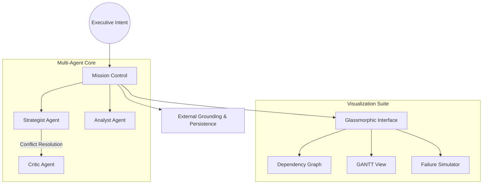

# 🌌 Atlas Strategic Agent V3.0

[](./CHANGELOG.md)
[](https://github.com/darshil0/atlas-strategic-agent)
[](./package.json)

**Atlas V3.0** is an elite **Autonomous Strategic Agent** designed to bridge the gap between high-level executive intent and actionable enterprise roadmaps. Powered by a multi-agent collaborative core, it doesn't just decompose tasks—it orchestrates intelligence.

---

## 🚀 Key Innovation Pillars

### 🧠 Multi-Agent Collaborative Synthesis
Unlike traditional AI tools, Atlas operates through a triumvirate of specialized personas:
- **The Strategist**: Architect of goal decomposition and logic flows.
- **The Analyst**: Feasibility expert focused on data grounding and verification.
- **The Critic**: Risk assessor who identifies missing dependencies and failure points.

### 📉 Strategic Visualization Engine
- **Live Dependency Graph**: Interactive ReactFlow-based visualization of mission-critical paths.
- **GANTT Timeline**: A chronological roadmap view for temporal mission alignment.
- **What-If Simulation**: Predictive engine that predicts mission failure cascades and calculates risk scores before execution begins.

### 🔗 Enterprise-Grade Connectivity
- **A2UI Protocol**: Native Agent-to-User Interface for streamlined human-in-the-loop interactions.
- **Live Grounding**: Real-time context injection from external URLs and strategic documentation.
- **Mission Persistence**: Full state recovery for long-running strategic planning.

---

## 🛠 System Architecture



---

## 💻 Tech Stack

- **Core Intelligence**: Gemini 1.5 Flash (Optimized for strategic reasoning)
- **Frontend Framework**: React 19 + Vite (Next-gen performance)
- **Visualization**: React Flow 11 (High-performance graph engine)
- **Styling System**: Tailwind CSS + Glassmorphism (Premium Enterprise Aesthetic)
- **State & Logic**: 100% Strict TypeScript (Zero-Any Architecture)

---

## 🏃 Getting Started

### 1. Installation
```bash
npm install
```

### 2. Configuration
Create a `.env` file in the root directory:
```env
VITE_GEMINI_API_KEY=your_api_key_here
```

### 3. Execution
```bash
npm run dev
```

---

## 🗺 Roadmap
- [x] Multi-Agent Synthesis Engine
- [x] Predictive Failure Simulation
- [ ] Direct GitHub/Jira Issue Sync (Coming V3.1)
- [ ] Collaborative Real-time Planning (Coming V3.2)

---
*Atlas Strategic Agent is a product of the Advanced Agentic Coding initiative.*
